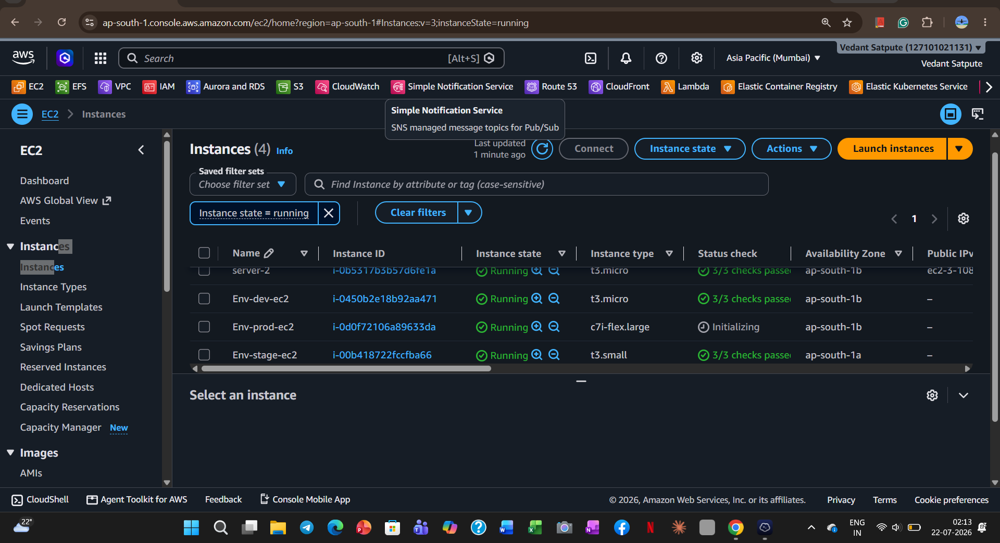

# 🚀 Terraform Multi-Environment Infrastructure using Modules & Workspaces

## 📌 Project Overview

This project demonstrates how to provision AWS infrastructure using **Terraform Modules** and **Terraform Workspaces**. It follows Infrastructure as Code (IaC) best practices by creating reusable modules and maintaining separate state files for **Development**, **Staging**, and **Production** environments.

The project provisions:

* 🌐 VPC
* 🌍 Public & Private Subnets
* 🚪 Internet Gateway
* 🌉 NAT Gateway
* 📌 Elastic IP
* 🛣 Route Tables & Route Table Associations
* 🔐 Security Group (SSH + Outbound Rules)
* 💻 EC2 Instance

---

# 📂 Project Structure

```text
.
├── README.md
├── main.tf
├── variables.tf
├── terraform.tfvars
├── modules
│   ├── ec2
│   │   ├── main.tf
│   │   └── variables.tf
│   ├── sg
│   │   ├── main.tf
│   │   ├── outputs.tf
│   │   └── variables.tf
│   ├── subnet
│   │   ├── main.tf
│   │   ├── outputs.tf
│   │   └── variables.tf
│   └── vpc
│       ├── main.tf
│       ├── output.tf
│       └── variables.tf
├── workspace
│   ├── dev.tfvars
│   ├── stage.tfvars
│   └── prod.tfvars
├── terraform.tfstate
├── terraform.tfstate.backup
└── terraform.tfstate.d
    ├── dev
    ├── stage
    └── prod
```

---

# ⚙️ Technologies Used

* Terraform
* AWS
* Linux
* Git & GitHub

---

# 📦 Terraform Modules

## 1️⃣ VPC Module

Creates:

* AWS VPC
* Internet Gateway

---

## 2️⃣ Subnet Module

Creates:

* Public Subnet
* Private Subnet
* Elastic IP
* NAT Gateway
* Public Route Table
* Private Route Table
* Route Table Associations

---

## 3️⃣ Security Group Module

Creates:

* Security Group
* SSH (Port 22) Ingress Rule
* Outbound (All Traffic) Egress Rule

---

## 4️⃣ EC2 Module

Creates:

* EC2 Instance
* Attaches Security Group
* Launches instance in the Public Subnet

---

# 🌍 Terraform Workspaces

This project supports multiple environments using Terraform Workspaces.

| Workspace | Purpose                 |
| --------- | ----------------------- |
| dev       | Development Environment |
| stage     | Staging Environment     |
| prod      | Production Environment  |

Each workspace has an independent Terraform state file.

---

# 📁 Environment Variable Files

```text
workspace/
├── dev.tfvars
├── stage.tfvars
└── prod.tfvars
```

Each `.tfvars` file contains environment-specific values such as:

* VPC CIDR
* Public Subnet CIDR
* Private Subnet CIDR
* Instance Type
* Project Name

---

# 🚀 Deployment Commands

## Initialize Terraform

```bash
terraform init
```

## Create Workspaces

```bash
terraform workspace new dev
terraform workspace new stage
terraform workspace new prod
```

## Select Workspace

```bash
terraform workspace select dev
```

## Validate Configuration

```bash
terraform validate
```

## Preview Changes

```bash
terraform plan -var-file="workspace/dev.tfvars"
```

## Apply Configuration

```bash
terraform apply -var-file="workspace/dev.tfvars"
```

## Destroy Infrastructure

```bash
terraform destroy -var-file="workspace/dev.tfvars"
```

---

# 📋 Terraform Resources Created

The project provisions the following AWS resources:

```text
module.vpc.aws_vpc.this
module.vpc.aws_internet_gateway.igw

module.subnet.aws_subnet.public
module.subnet.aws_subnet.private
module.subnet.aws_eip.eip
module.subnet.aws_nat_gateway.nat
module.subnet.aws_route_table.rt
module.subnet.aws_route_table.rt-1
module.subnet.aws_route_table_association.rt-nat
module.subnet.aws_route_table_association.tr-as

module.sg.aws_security_group.this
module.sg.aws_vpc_security_group_ingress_rule.ssh
module.sg.aws_vpc_security_group_egress_rule.all

module.ec2.aws_instance.this
```
<h2 align="center">🚀 Terraform Apply Output</h2>
<p align="center">
  
</p>  

```
# ✅ Features

* Reusable Terraform Modules
* Multi-Environment Deployment
* Terraform Workspaces
* Separate State Files
* Infrastructure as Code (IaC)
* Modular Project Structure
* Easy to Scale
* AWS Best Practices

---

# 📖 Learning Outcomes

Through this project, I learned:

* Terraform Modules
* Terraform Workspaces
* Infrastructure as Code (IaC)
* AWS Networking
* VPC Architecture
* Route Tables
* NAT Gateway
* Internet Gateway
* Security Groups
* EC2 Provisioning
* Terraform State Management
* Multi-Environment Infrastructure Design

---

# 📚 Future Improvements

* Store Terraform State in an S3 Backend
* Enable DynamoDB State Locking
* Add Remote Backend Configuration
* Create Reusable Output Modules
* Implement GitHub Actions or Jenkins CI/CD
* Add Terraform Formatting & Validation Pipeline
* Integrate AWS IAM Roles and Policies

---

# 👨‍💻 Author

**Vedant Satpute**

* GitHub: https://github.com/vedant-07-git

---

## ⭐ If you found this project useful, consider giving the repository a Star!
